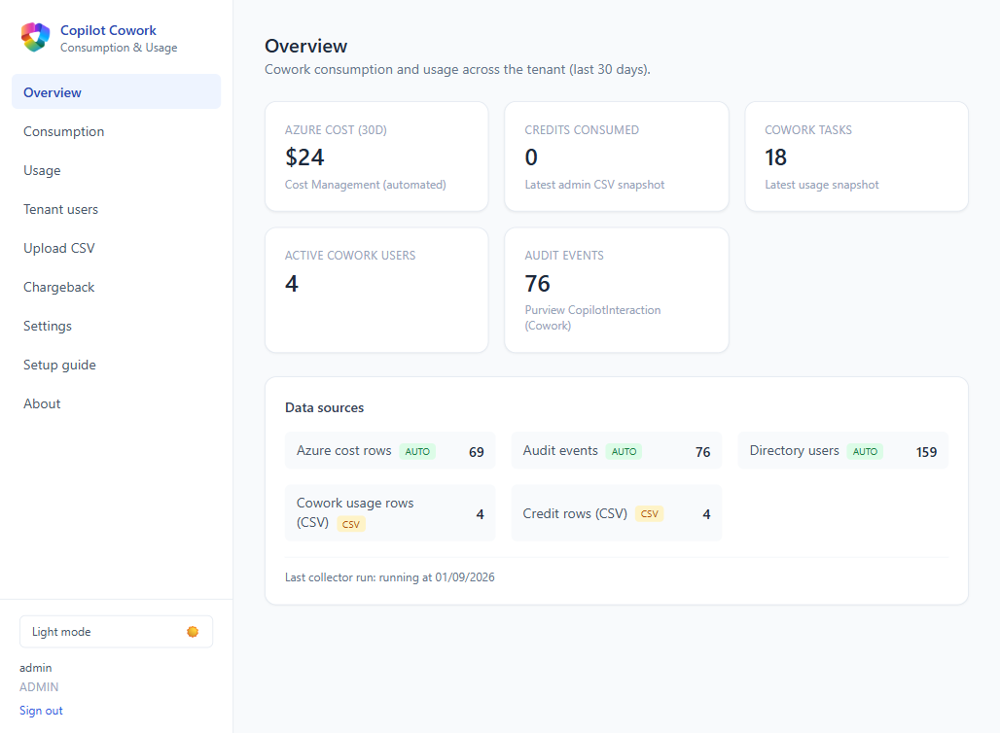
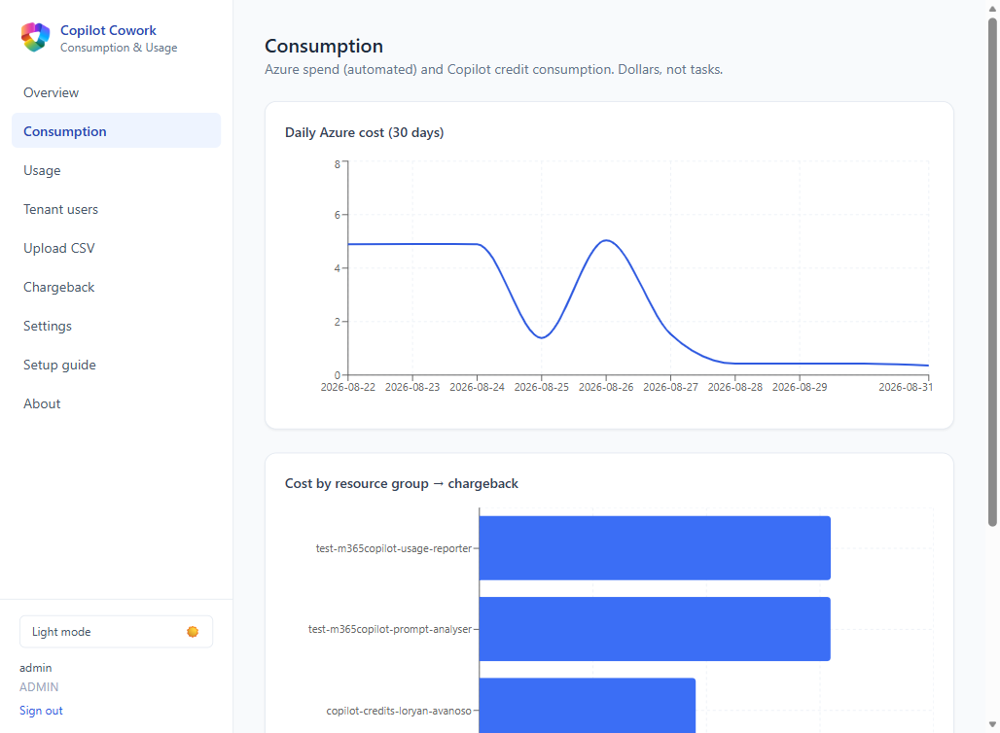
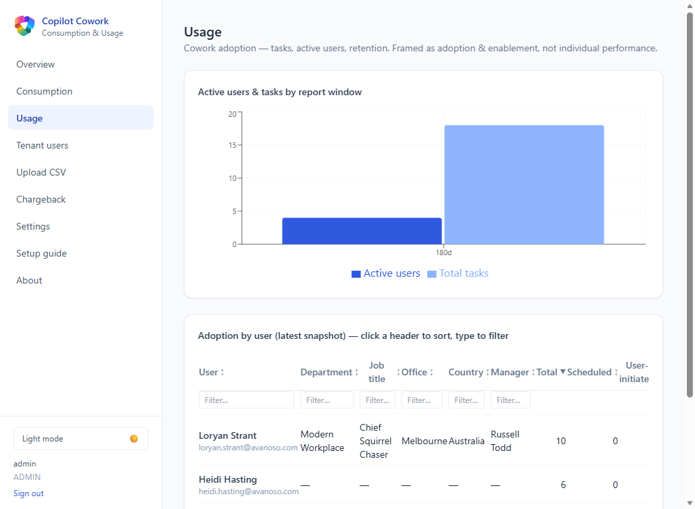
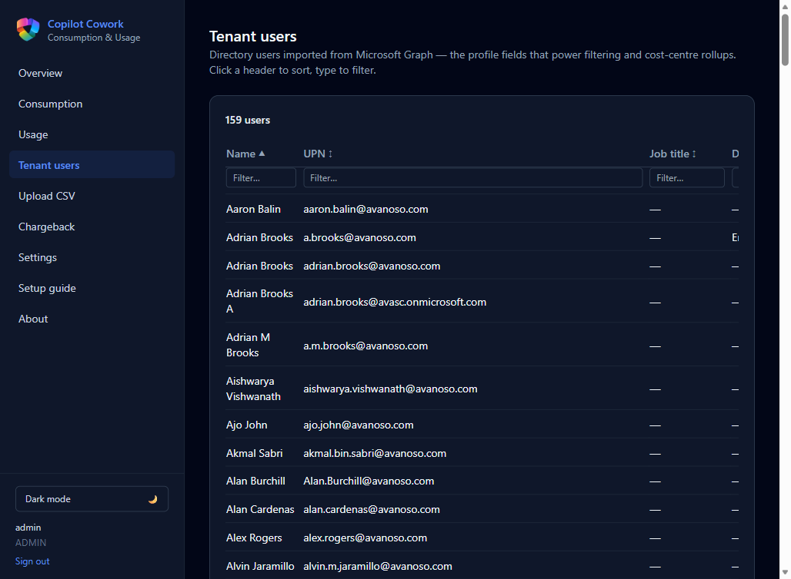
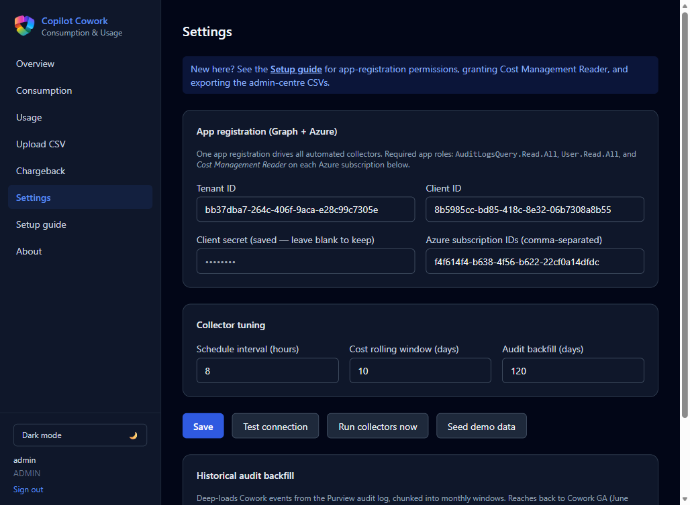
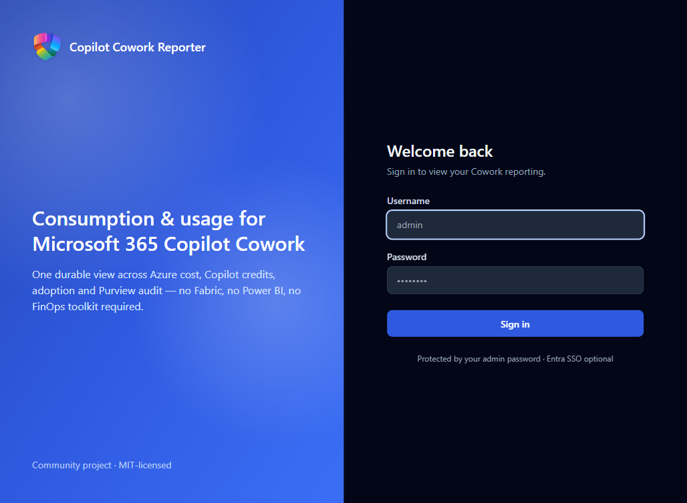

# M365 Copilot Cowork Reporter

Self-contained, containerised reporting for **Microsoft 365 Copilot Cowork** —
showing both **consumption** (Azure cost + Copilot credits) and **usage**
(tasks, adoption, and Purview audit events). No FinOps toolkit, no Fabric, no
Power BI — just a small FastAPI + worker + Postgres + React app you can run with
`docker compose up` or deploy to Azure with one click.

[](https://portal.azure.com/#create/Microsoft.Template/uri/https%3A%2F%2Fraw.githubusercontent.com%2Floryanstrant%2FM365Copilot-Cowork-Reporter%2Fmain%2Finfra%2Fazuredeploy.json/createUIDefinitionUri/https%3A%2F%2Fraw.githubusercontent.com%2Floryanstrant%2FM365Copilot-Cowork-Reporter%2Fmain%2Finfra%2FcreateUiDefinition.json)

> Community project, MIT-licensed. Not covered by a Microsoft support agreement.

## Screenshots

| Overview | Consumption |
|---|---|
|  |  |

| Usage (sortable/filterable) | Tenant users |
|---|---|
|  |  |

| Settings (dark mode) | Sign in |
|---|---|
|  |  |

## Why this exists

Copilot Cowork has **no single reporting API**. The data you need is scattered
across sources with different access models. This app is a **collector** that
joins them into one durable store and presents Consumption and Usage as separate
views (joined on user, never blended — dollars vs task counts).

| Signal | Source | Mode |
|---|---|---|
| Azure spend by resource group | Cost Management Query API | **Automated** (app-only) |
| Cowork events / resources touched | Purview audit (`CopilotInteraction`) | **Automated** (app-only) |
| Org context (dept, cost centre) | Microsoft Graph `/users` | **Automated** (app-only) |
| Cowork tasks / adoption | Admin centre Cowork usage report | **CSV upload** |
| Copilot credit consumption | Admin centre Cost Management | **CSV upload** |

The two CSV sources have **no Microsoft API** (validated against a live tenant).
They are uploaded from the admin centre's Export button. If Microsoft ships an
API later, the collector gains a loader and nothing downstream changes.

### Cowork identification in Purview audit

A `CopilotInteraction` audit record is treated as Cowork when
`CopilotEventData.AppHost == "cowork"` **or**
`AppIdentity == "Copilot.M365Copilot.CoworkChat"` (both co-occur, alongside
`AgentName == "Copilot Cowork"`). Audit answers *who / when / what-touched* —
never task volume (use the usage CSV) or cost (use the cost/credits sources).
Prompt text is never stored.

## Architecture

```
Azure Cost Mgmt API ─┐
Purview audit  ───────┼─► worker (APScheduler) ─► Postgres ─► FastAPI ─► React SPA
Graph /users   ───────┘                              ▲
Admin CSV exports ───────── API upload endpoints ────┘
```

- **api/** — FastAPI: auth (password gate + optional Entra SSO), admin config,
  CSV upload, metrics/reporting.
- **worker/** — scheduled collectors (cost / audit / users), a deep audit
  backfill, and CSV importers.
- **shared/** — SQLAlchemy star schema, config, crypto, migrations.
- **frontend/** — React + Vite + Tailwind: Overview, Consumption, Usage,
  Upload, Chargeback, Settings, Setup guide.
- **infra/** — Bicep (azd) + compiled ARM + createUiDefinition (Deploy button).

### Star schema

- Consumption: `fact_daily_cost`, `fact_credit_consumption`
- Usage: `fact_cowork_usage`, `fact_cowork_event`
- Dimensions: `dim_user`, `dim_billing_policy` (UI-editable chargeback mapping)

## Run locally

```powershell
Copy-Item .env.example .env
# generate a Fernet key and paste it into .env (FERNET_KEY=...)
python -c "from cryptography.fernet import Fernet; print(Fernet.generate_key().decode())"
docker compose up --build
```

- Dashboard: http://localhost:5174
- API / Swagger: http://localhost:8001/docs

Sign in with `ADMIN_USERNAME` / `ADMIN_PASSWORD` from `.env`. On the **Settings**
page, click **Seed demo data** to populate the dashboards without live sources.

> Ports default to 5174/8001/5433 so this can run alongside sibling solutions
> on one machine.

## Configure live data

The app has a built-in **Setup guide** page with these same steps, so whoever
operates it doesn't need this README.

### 1. App registration (automated collectors)

One Entra app registration powers all three automated collectors.

1. **Entra admin centre → App registrations → New registration**. Copy the
   **Directory (tenant) ID** and **Application (client) ID**.
2. **Certificates & secrets → New client secret**; copy the value immediately.
3. **API permissions → Add a permission → Microsoft Graph → Application
   permissions**: add `AuditLogsQuery.Read.All` and `User.Read.All`, then
   **Grant admin consent**.
4. Paste tenant ID, client ID and secret into **Settings** and **Test
   connection**.

> ⚠️ Microsoft began enforcing `AuditLogsQuery.Read.All` in April 2026. The
> legacy `AuditLog.Read.All` silently returns **zero** Copilot records — grant
> the *Query* permission above.

### 2. Azure Cost Management (spend by resource group)

1. **Azure portal → Subscriptions** → copy the **Subscription ID** of each
   subscription holding a Copilot billing-policy resource group.
2. On each subscription: **Access control (IAM) → Add role assignment →
   Cost Management Reader**, assigned to the app registration above.
3. Paste the subscription IDs (comma-separated) into **Settings**, save, and
   **Test connection** — the "Cost Management read" check should go green.
4. On the **Chargeback** page, map each resource group to a cost centre / owner.

Cost data restates as charges settle, so the collector re-pulls and replaces a
trailing window (default 10 days) each run. "Near-real-time" means yesterday's
costs by mid-morning, not live spend.

### 3. Cowork usage report CSV (tasks & adoption)

There is no API for Cowork task metrics.

1. **M365 admin centre** (`admin.cloud.microsoft`) → **Copilot → Cowork →
   Usage** tab (data from 1 April 2026; default window 28 days).
2. Click **Export** to download the CSV (User Principal Name, Display Name,
   Total/Scheduled/User-initiated Tasks, Active Days, Last Activity Date).
3. **Upload CSV → Cowork usage report**: choose the file, set the report period
   (7/28/90/180) matching the window you exported, upload.

### 4. Copilot Credits / Cost Management CSV (credit consumption)

Credit consumption also has no API.

1. **M365 admin centre → Copilot → Cost Management** (Cowork & Work IQ credit
   billing), or **Reports → Usage → Microsoft Copilot → Credits**.
2. Choose the **Consumption** tab and the scope (by user, by service — includes
   a "Cowork" row — or by group).
3. Click **Export CSV**.
4. **Upload CSV → Copilot Credits / Cost Management**: pick the matching
   **Export scope** and upload. Re-uploading a fresher export updates the rows.

### 5. Historical audit backfill

**Settings → Historical audit backfill** deep-loads Cowork events from the
Purview audit log, chunked into monthly windows, reaching back to Cowork GA
(June 2026) or a shorter look-back you specify. Safe to re-run — events upsert
on their ID.

## Deploy to Azure

Click the button at the top. It provisions a PostgreSQL flexible server and two
Container Apps (api + worker) pulling prebuilt public images from GHCR, and asks
only for an admin password. Optionally enable Entra ID SSO for read-only viewers.

The Deploy button requires the images to be published and public — push to
`main` to trigger the **Publish container images** workflow, then set both
packages' visibility to Public once.

## Data & privacy notes

- Per-user usage is framed as **adoption and enablement**, not performance.
- Report-name concealment (admin centre setting) will hash UPNs in exports if
  enabled — decide this tenant-wide before relying on user-level detail.
- Cost data restates; the cost collector does a **rolling-window replace** of the
  trailing N days each run (idempotent, self-healing).
- No unsupported internal admin APIs are called — CSV export is the supported
  path for the two admin-centre reports.
